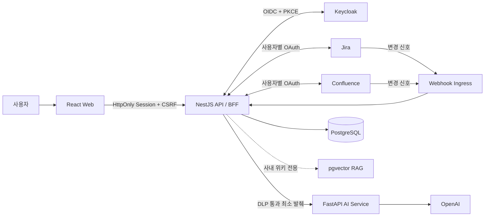

# Work Copilot

> **Jira 이슈와 Confluence 문서를 사용자의 실제 권한으로 읽어, 출처가 연결된 업무 브리프를 만들고 검토·승인 뒤 게시하는 AI 코파일럿**

`React 19` `TypeScript` `NestJS 11` `FastAPI` `PostgreSQL + pgvector` `Keycloak OIDC` `OpenAI`

[포트폴리오에서 보기](https://dhkim.cloud/work-copilot) · [설계 사례](docs/portfolio-case-study.md) · [평가 기준](docs/evaluation.md) · [빠른 시작](#빠른-시작)

## 30초 요약

| 항목 | 내용 |
| --- | --- |
| 사용자 문제 | 새 업무를 맡을 때 Jira 이슈, Confluence 문서와 정책을 여러 화면에서 다시 조합해야 합니다. |
| 주요 기능 | 근거 선택, Citation이 연결된 업무 브리프 생성, 최신성·필수 항목 점검, 승인 뒤 게시 |
| 핵심 판단 | Jira·Confluence 원문을 중앙 RAG에 모으지 않고 요청 시점의 사용자 OAuth 권한으로 조회합니다. |
| 안전장치 | DLP·PII 처리, Evidence Version 확인, 사용자 승인, 멱등 게시와 실패 단계 재처리 |
| 구현 범위 | Web, API/BFF, AI Service, 데이터 모델, 인증·권한, 자동 테스트와 단일 서버 배포 |

## 사용 흐름

1. **Jira 이슈를 고릅니다.**
2. 서버가 **현재 사용자의 Atlassian OAuth 권한**으로 관련 Jira·Confluence 자료를 조회합니다.
3. 필요한 근거만 선택하고, AI에 전달하기 전에 **비밀정보 차단과 한국어 PII 마스킹**을 적용합니다.
4. 요구사항, 위험, 다음 작업마다 **Evidence ID와 원문 링크가 연결된 브리프**를 만듭니다.
5. Citation, 필수 필드, 차단 의존성과 문서 Version을 읽기 전용으로 점검합니다.
6. 사용자가 결과를 확인하고 승인한 뒤에만 외부 게시 단계로 진행합니다.

## 주요 설계 판단

### 1. 서비스 로그인과 원문 접근 권한을 분리했습니다

Keycloak은 Work Copilot의 로그인 세션을 담당하고, Jira·Confluence 조회는 사용자별 Atlassian OAuth 연결을 사용합니다. 같은 조직에 속한 사용자라도 원천 시스템에서 볼 수 있는 문서가 다르면 Work Copilot에서 조회되는 근거도 달라집니다.

### 2. Jira·Confluence 원문을 중앙 RAG에 적재하지 않습니다

업무 브리프를 만들 때마다 현재 사용자의 권한으로 원문을 조회합니다. Evidence에는 Provider ID, URL, Version과 최소 발췌를 연결하고, 권한 상실이나 Version 변경을 감지하면 기존 브리프를 다시 검토하도록 상태를 바꿉니다.

사내 위키 검색용 pgvector 인덱스는 별도 기능이며, 사용자별 Jira·Confluence 원문과 섞이지 않습니다.

### 3. 생성과 외부 변경을 나눴습니다

브리프 생성은 읽기 전용 단계에서 끝납니다. 외부 게시에는 최신성·DLP·필수 항목 확인과 사용자의 명시적 승인이 필요합니다. 게시 작업은 Idempotency-Key와 단계별 상태를 저장해, 네트워크 오류나 새로고침 뒤에도 이미 성공한 작업을 중복 생성하지 않도록 구성했습니다.

### 4. 원문 보관 범위를 줄였습니다

AI 서비스에는 DLP를 통과한 최소 발췌만 전달합니다. 원문 발췌가 필요한 경우에만 암호화해 최대 24시간 보관하고, 장기 보관 대상은 마스킹된 브리프와 근거 식별자·Version입니다.

설계 배경과 실패 시나리오는 [포트폴리오용 설계 사례](docs/portfolio-case-study.md)에 정리했습니다.

## 아키텍처



| 영역 | 구성 |
| --- | --- |
| Web | React 19, Vite, TypeScript |
| API | NestJS 11, TypeORM, PostgreSQL |
| AI | FastAPI, LangChain, OpenAI, pgvector 하이브리드 검색 |
| 인증·보안 | Keycloak OIDC Authorization Code + PKCE, HttpOnly Session, CSRF·Origin 검증, AES-256-GCM |
| 연동·운영 | Jira·Confluence OAuth, Webhook Freshness, Idempotent Publication, Docker Compose, Sophos WAF |

## 검증

검증 기준은 `main@08d2e3e`이며, 아래 수치는 해당 시점의 자동 테스트 기록입니다.

| 영역 | 기록 |
| --- | --- |
| Node | 64개 Suite, 178개 Test |
| FastAPI AI Service | 26개 Test |
| 주요 시나리오 | 사용자별 권한 차이, DLP, Citation, Version 변경, 중복 요청, 부분 게시 실패 |

```bash
npm run build
npm test
docker compose --env-file deploy/.env.production.example config --quiet
```

AI 서비스 단위 테스트:

```bash
cd backend/ai-service
source .venv/bin/activate
python -m unittest discover -s tests -p 'test_*.py'
```

자동 테스트 개수와 RAG 품질 지표는 성격이 다릅니다. 검색·Citation·DLP 품질의 측정 방법과 보고서 작성 규칙은 [평가 기준](docs/evaluation.md)을 참고하세요.

## 빠른 시작

### 요구 사항

- Node.js 22
- npm 10 이상
- Python 3.12
- Docker Compose

### 의존성과 환경 파일

```bash
npm ci
cp backend/.env.example backend/.env
cp backend/ai-service/.env.example backend/ai-service/.env
cp frontend/.env.example frontend/.env
```

```bash
cd backend/ai-service
python3.12 -m venv .venv
source .venv/bin/activate
pip install -r requirements.txt
cd ../..
```

### 데이터베이스와 스키마

```bash
docker compose -f compose.dev.yaml up -d
npm run migration:run --workspace=backend
```

### 서비스 실행

```bash
npm run dev:backend
```

```bash
cd backend/ai-service
source .venv/bin/activate
uvicorn main:app --reload --port 8000
```

```bash
npm run dev:frontend
```

| 서비스 | 로컬 주소 |
| --- | --- |
| Web | `http://localhost:5173` |
| API | `http://localhost:3000` |
| AI Service | `http://localhost:8000` |

## 환경 변수와 비밀정보

`*.env.example`에는 변수 이름과 안전한 기본값만 있습니다. 실제 비밀값은 저장소에 추가하지 않습니다.

| 목적 | 주요 변수 |
| --- | --- |
| 서비스 로그인 | `KEYCLOAK_ISSUER`, `KEYCLOAK_CLIENT_ID`, `KEYCLOAK_CLIENT_SECRET`, `OIDC_ATTEMPT_ENCRYPTION_KEY` |
| Jira·Confluence 연동 | `INTEGRATION_ENCRYPTION_KEY`, `INTEGRATION_CALLBACK_BASE_URL`, Provider Scope Allowlist |
| AI 서비스 보호 | `AI_SERVICE_URL`, `AI_SERVICE_API_KEY`, `OPENAI_API_KEY` |
| 데이터 보존 | `TRANSIENT_CONTENT_ENCRYPTION_KEY`, `TRANSIENT_EVIDENCE_TTL_SECONDS` |

관리자 권한은 Keycloak의 `work-copilot-admin` Claim으로 판정합니다. `AI_SERVICE_API_KEY`는 NestJS와 FastAPI에 같은 값으로 설정하며, OpenAI 키와 함께 배포 환경의 Secret으로만 관리합니다.

## 저장소 구성

```text
.
├── backend/                 # NestJS BFF, 위키·노트·연동·브리프 API
│   └── ai-service/          # FastAPI RAG, DLP, 업무 브리프 생성
├── frontend/                # React + Vite 업무 공간
├── docs/                    # 설계 사례, 평가 기준, 아키텍처와 운영 문서
├── compose.yaml             # Ubuntu 단일 서버 전체 배포
├── compose.dev.yaml         # 개발용 PostgreSQL + pgvector
└── deploy/                  # 운영 환경 예제와 백업 Timer
```

## 배포

운영 서비스는 Ubuntu 24.04 서버의 Docker Compose로 실행합니다. Sophos WAF가 `https://work-copilot.dhkim.cloud:443`을 종료하고 서버의 사설 IP `:7236`으로 전달합니다. 웹과 API는 같은 도메인에서 제공되며 API 경로는 `/api`입니다.

```bash
cp deploy/.env.production.example .env.production
chmod 600 .env.production
# 실제 비밀값과 서버 사설 IP를 입력한 뒤 실행
docker compose --env-file .env.production up --build -d
```

자세한 WAF, OAuth Callback, 백업과 복구 절차는 [Ubuntu 24.04 배포 안내](docs/ubuntu-24.04-deployment.md)를 참고하세요.

## 문서

- [포트폴리오용 설계 사례](docs/portfolio-case-study.md)
- [AI·제품 평가 기준](docs/evaluation.md)
- [백엔드 API와 환경 변수](backend/README.md)
- [AI 서비스와 위키 데이터 적재](backend/ai-service/README.md)
- [RAG 평가 실행 안내](backend/ai-service/evals/README.md)
- [Ubuntu 24.04 단일 서버 배포](docs/ubuntu-24.04-deployment.md)
- [업무 코파일럿 MVP 구현 계획](docs/jira-confluence-work-copilot-implementation-plan.md)
