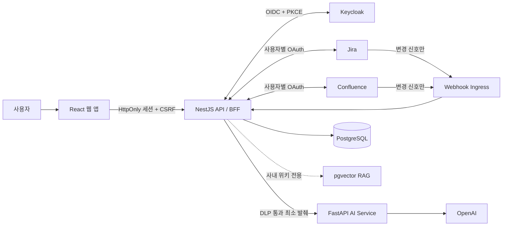

# Work Copilot

> **Jira 이슈와 Confluence 지식을, 검증 가능한 실행 브리프로 바꾸는 사내 업무 코파일럿**

Confluence에 쌓인 사내 지식과 Jira 이슈를 연결해 업무 계획을 만드는 AI 업무 코파일럿입니다. 사용자가 실제로 접근할 수 있는 Jira·Confluence 근거만 선택해 AI 브리프를 만들고, 검토와 명시적 승인 뒤에만 외부 시스템에 반영합니다.

`NestJS` `FastAPI` `React` `PostgreSQL + pgvector` `Keycloak OIDC` `OpenAI`

## 왜 Work Copilot인가

업무를 시작할 때마다 이슈, 관련 문서, 정책, 이전 논의를 오가며 맥락을 재구성하는 시간을 줄입니다. 단순 요약에서 멈추지 않고 **근거·최신성·게시 승인**을 제품 흐름 안에 남겨, AI 결과를 실제 업무에 사용할 수 있게 만듭니다.

| 필요한 순간           | Work Copilot이 하는 일                                                 |
| --------------------- | ---------------------------------------------------------------------- |
| 새 이슈를 맡았을 때   | Jira 이슈와 연결된 Confluence 근거를 사용자 권한으로 수집합니다.       |
| 실행 계획이 필요할 때 | 선택된 근거마다 출처를 연결한 업무 브리프와 하위 작업 초안을 만듭니다. |
| 게시 전에 확인할 때   | 요구사항·필수 필드·차단 의존성·근거 최신성을 읽기 전용으로 점검합니다. |
| 정보가 바뀌었을 때    | Webhook 변경 신호로 재검토가 필요한 브리프를 표시합니다.               |

## 핵심 경험

### 근거에서 시작하는 업무 브리프

Jira 이슈 키를 입력하면 현재 사용자의 OAuth 권한으로 관련 Jira·Confluence 근거를 읽어옵니다. 필요한 자료만 골라 브리프를 생성하고, 각 결과 항목을 근거 ID와 연결합니다. 새로고침·동시 편집 충돌·근거 버전 변경도 다루므로, 오래된 초안을 그대로 게시하지 않습니다.

### AI를 업무에 안전하게 연결

- Jira·Confluence 원문은 기존 사내 위키 RAG 색인으로 보내지 않습니다.
- 비밀정보 차단 및 한국어 PII 마스킹을 거친 최소 발췌만 AI에 전달합니다.
- 원문 발췌는 필요할 때만 암호화해 최대 24시간 보관하며, 장기 보관 대상은 마스킹된 브리프와 근거 식별자·버전입니다.
- 외부 쓰기는 사용자 승인, 최신성 확인, DLP 검사를 통과한 경우에만 실행됩니다.

### 팀이 함께 쓰는 사내 지식 공간

- 부서·태그·키워드로 탐색하는 회사 위키 트리와 댓글
- 개인 노트 작성·수정·삭제 및 AI 답변을 노트로 저장
- 위키 기반 RAG 챗봇, 부서별 온보딩 추천, 교육 강의안 생성
- 관리자용 연동 프로필·연결 상태·AI 동기화 운영 화면

> [!TIP]
> Jira와 Confluence 접근 권한은 서비스 로그인과 분리됩니다. Keycloak은 서비스 세션을, 사용자별 Atlassian OAuth 연결은 원본 조회 권한을 담당합니다.

## 작동 방식



## 기술 구성

| 영역      | 구성                                                                                         |
| --------- | -------------------------------------------------------------------------------------------- |
| Web       | React 19, Vite, TypeScript, Tabler Icons                                                     |
| API       | NestJS 11, TypeORM, PostgreSQL                                                               |
| AI        | FastAPI, LangChain, OpenAI, pgvector 하이브리드 검색                                         |
| 인증·보안 | Keycloak OIDC Authorization Code + PKCE, HttpOnly 세션, CSRF·Origin 검증, AES-256-GCM 암호화 |
| 연동·운영 | Jira·Confluence OAuth, Webhook freshness, idempotent publication saga, Render                |

## 빠른 시작

### 1. 준비물

- Node.js 22
- npm 10 이상
- Python 3.12
- Docker Compose

### 2. 의존성 및 환경 파일 준비

루트에서 두 Node.js workspace의 의존성을 함께 설치합니다.

```bash
npm ci
cp backend/.env.example backend/.env
cp backend/ai-service/.env.example backend/ai-service/.env
cp frontend/.env.example frontend/.env
```

AI 서비스는 별도 가상환경을 사용합니다.

```bash
cd backend/ai-service
python3.12 -m venv .venv
source .venv/bin/activate
pip install -r requirements.txt
cd ../..
```

### 3. 데이터베이스와 스키마 준비

```bash
docker compose up -d
npm run migration:run --workspace=backend
```

### 4. 세 서비스를 각각 실행

```bash
npm run dev:backend
```

```bash
cd backend/ai-service
source .venv/bin/activate
uvicorn main:app --reload --port 8000
```

```bash
npm run dev:frontend
```

| 서비스     | 로컬 주소               |
| ---------- | ----------------------- |
| Web        | `http://localhost:5173` |
| API        | `http://localhost:3000` |
| AI service | `http://localhost:8000` |

## 환경 변수와 보안 설정

`*.env.example`에는 필요한 변수 이름과 안전한 기본값만 있습니다. 실제 비밀값은 절대 저장소에 추가하지 마세요.

| 목적                 | 주요 변수                                                                                        |
| -------------------- | ------------------------------------------------------------------------------------------------ |
| 서비스 로그인        | `KEYCLOAK_ISSUER`, `KEYCLOAK_CLIENT_ID`, `KEYCLOAK_CLIENT_SECRET`, `OIDC_ATTEMPT_ENCRYPTION_KEY` |
| Jira·Confluence 연동 | `INTEGRATION_ENCRYPTION_KEY`, `INTEGRATION_CALLBACK_BASE_URL`, provider scope allowlist          |
| AI 서비스 보호       | `AI_SERVICE_URL`, `AI_SERVICE_API_KEY`, `OPENAI_API_KEY`                                         |
| 데이터 보존          | `TRANSIENT_CONTENT_ENCRYPTION_KEY`, `TRANSIENT_EVIDENCE_TTL_SECONDS`                             |

관리자 권한은 Keycloak의 `work-copilot-admin` claim으로 판정합니다. `AI_SERVICE_API_KEY`는 NestJS와 FastAPI에 같은 값으로 설정해야 하며, OpenAI 키와 함께 `.env` 또는 배포 환경의 secret으로만 관리합니다.

## 검증 명령

```bash
npm run build
npm test
docker compose config
```

AI 서비스 단위 테스트는 다음처럼 실행합니다.

```bash
cd backend/ai-service
source .venv/bin/activate
python -m unittest discover -s tests -p 'test_*.py'
```

1,000개 위키를 적재한 뒤 실제 `sourceId`로 Golden Set을 채우면, 기준선과 하이브리드 검색을 같은 모델에서 비교할 수 있습니다. 자세한 형식과 실행 명령은 [AI 평가 안내](backend/ai-service/evals/README.md)를 참고하세요.

## 저장소 구성

```text
.
├── backend/                 # NestJS BFF, 사내 위키·노트·연동·브리프 API
│   └── ai-service/          # FastAPI RAG, DLP, 업무 브리프 생성 서비스
├── frontend/                # React + Vite 업무 공간
├── docs/                    # 아키텍처와 구현 계획
├── docker-compose.yml       # 로컬 PostgreSQL + pgvector
└── render.yaml              # Render 배포 정의
```

## 배포

Render는 루트의 `render.yaml`을 사용해 API, AI 서비스, 정적 웹 앱을 각각 배포합니다. `main` 브랜치 변경은 자동 배포되며, 운영 PostgreSQL은 Supabase Shared Pooler session endpoint와 TLS 연결을 사용합니다.

- Web: <https://work-copilot-web.onrender.com>
- API: <https://work-copilot-api.onrender.com>
- AI: <https://work-copilot-ai.onrender.com>

## 더 알아보기

- [백엔드 API와 환경 변수](backend/README.md)
- [AI 서비스와 위키 데이터 적재](backend/ai-service/README.md)
- [업무 코파일럿 MVP 구현 계획](docs/jira-confluence-work-copilot-implementation-plan.md)

---

**정보를 찾는 시간은 줄이고, 근거 있는 실행은 빠르게.**
