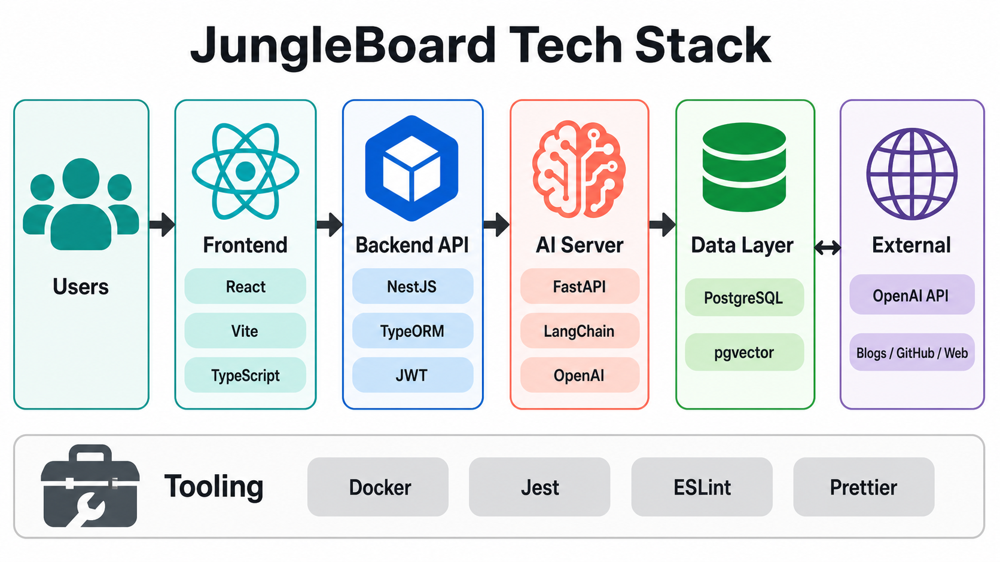
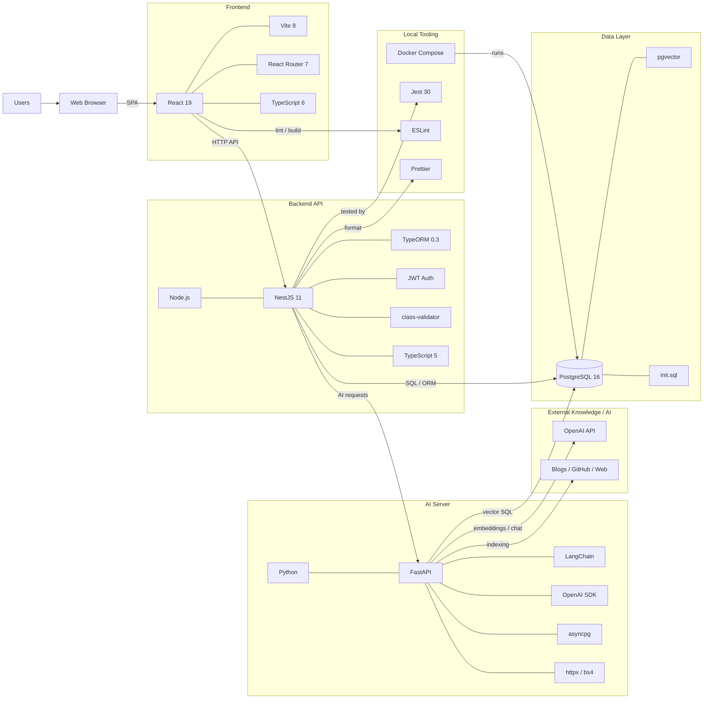

# JungleBoard Technology Stack





## Source Files

- `docs/technology-stack-diagram.py`: diagrams/mingrammer source of truth.
- `docs/technology-stack-diagram.md`: Mermaid preview for GitHub and documentation.

## Render

After Graphviz is available on the machine, render the PNG with:

```bash
.venv-diagrams/bin/python docs/technology-stack-diagram.py
```
